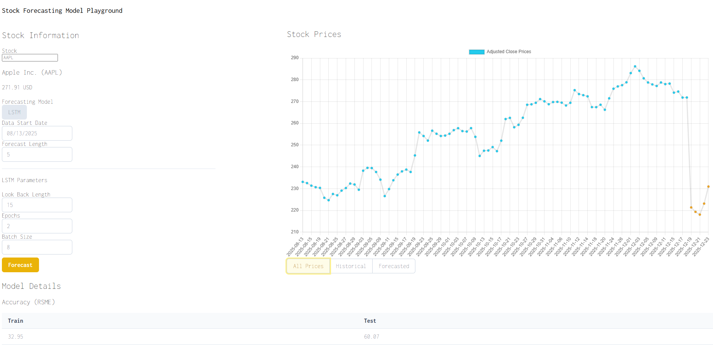
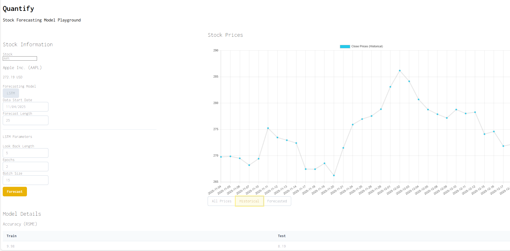
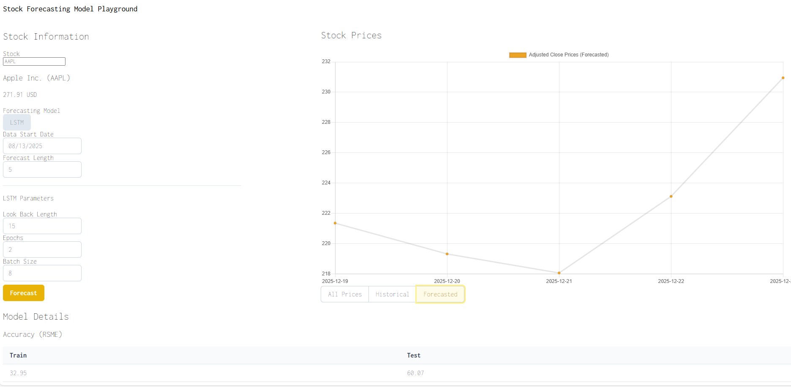

# Quantify

This is full-stack web application that leverages a Recurrent Neural Network (LSTM model) to forecast future stock prices.
While it is difficult to forecast stock prices in order to earn arbitrage returns, this project was created so that I could learn some of the basics of machine learning.

## Images

*Forecasted Apple Returns*


*Historical Data Only*



*Forecasted Data Only*



## Technologies Used

- Python
- Django
- JavaScript
- Vue.js
- Keras
- Tensorflow

## Set-up

I have only developed this in WSL, so please consider this when referencing my documentation. This application may not work on Windows.

1. Set-up backend and install dependencies.

```
make setup-backend
```

2. Start the back-end application.

```
make run-backend
```

3. In a separate terminal, start the front-end application.

```
make run-frontend
```

You should now be able to see the application in your computer's browser.


## Acknowledgments

1. I used this [valid tickers file](https://github.com/ahnazary/Finance/blob/master/finance/src/database/valid_tickers.csv) to ensure that the correct tickers are used.
2. I referenced [this YouTube video](https://www.youtube.com/watch?v=CbTU92pbDKw&t) to implement an LSTM model with Keras/Python.
3. I referenced [this article](https://machinelearningmastery.com/time-series-prediction-lstm-recurrent-neural-networks-python-keras/) to learn about how LSTM models work.
